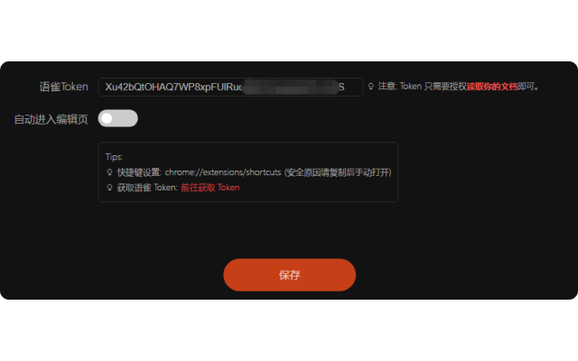
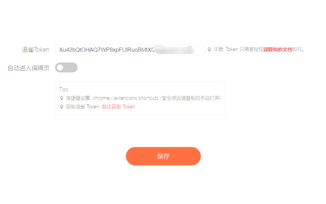
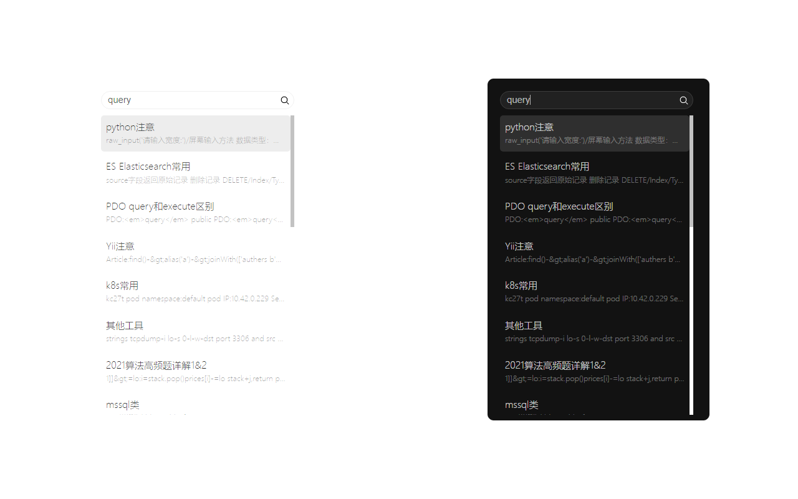

## 语雀快捷搜索插件

### 1️⃣ 插件地址

[Chrome Web Store](https://chrome.google.com/webstore/detail/yuque-helper/lffaohdkiepcnjnnbngjbmpgegbnepgf?hl=zh-CN)

[Microsoft Edge Store](https://microsoftedge.microsoft.com/addons/detail/madffokkiogcnjokeoibaadkjmjpbhhe)

如没有条件访问`Chrome Web Store`可以使用我打包好的[代码](https://github.com/yezige/yuque-search/releases/latest/download/yuque-search-release-latest.zip)，前往`chrome://extensions/`页面点击`加载已解压的扩展程序`

### 2️⃣ 使用方法

- 右键插件 -> 选项 -> 设置`语雀 Token`
- 点击插件(或使用`Alt+1`快捷键) -> 输入想搜索的关键字 -> 回车
- 再次回车，将在新标签页打开选中的文章

> 快捷键可前往`chrome://extensions/shortcuts`手动配置

### 3️⃣ 插件截图

### 4️⃣ 其他

有问题请提 `Issues`

### 5️⃣ 联系我

- Mail: [a@liu.app](mailto:a@liu.app)
- Telegram: [@yezige](https://t.me/yezige)

### 6️⃣ 请我喝杯咖啡

